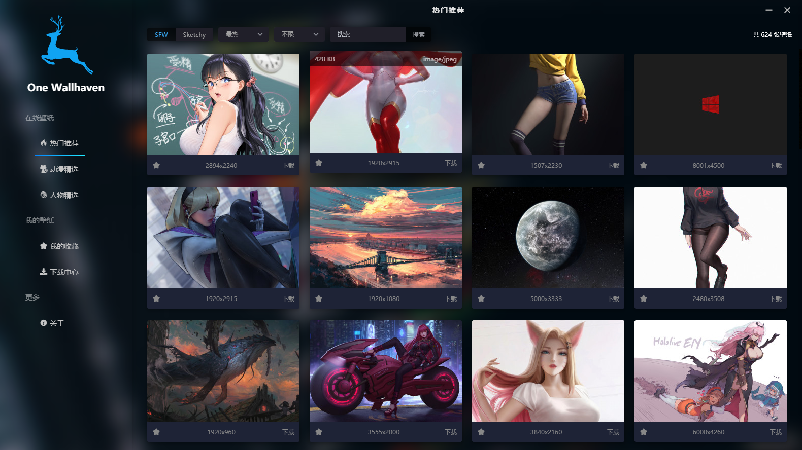
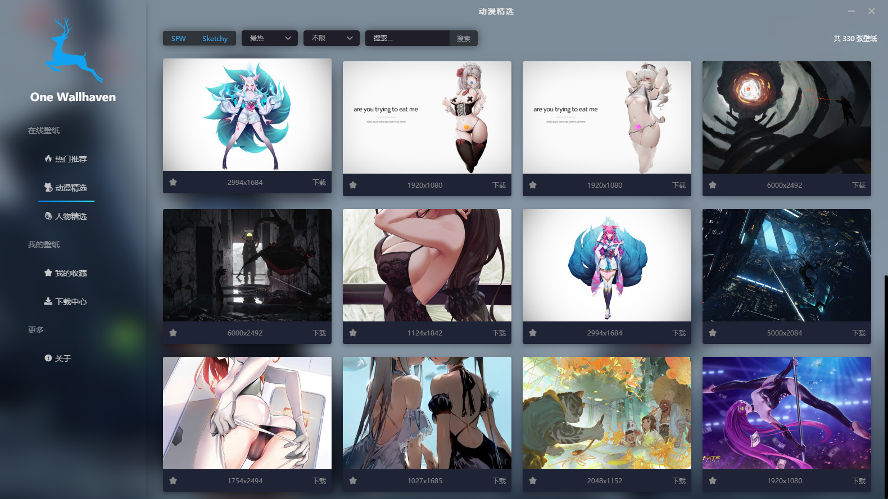
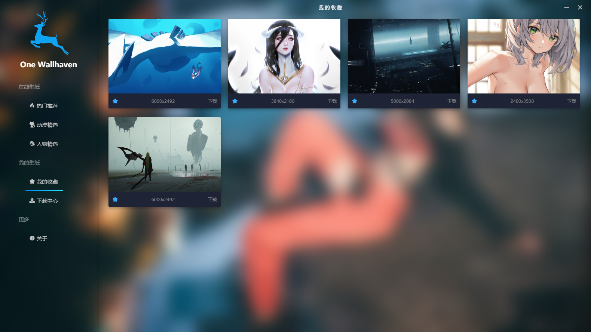
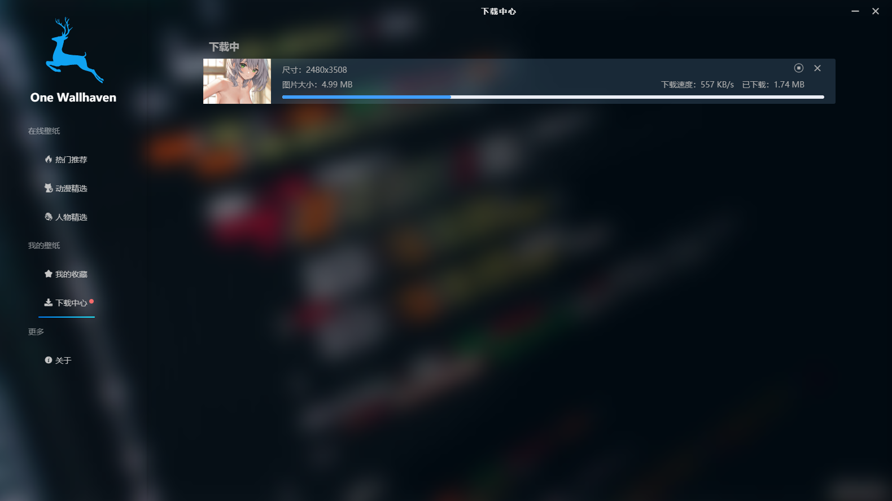

# wallhaven-electron

## 介绍
一款壁纸客户端 。 基于 Electron 构建 。

## 运行
```
# 安装依赖
yarn

# 运行开发模式
npm run serve:web
npm run serve:exe

# 打包安装文件 
npm run build:web
npm run build:exe

```
## demo






## Api
[wallhaven.cc](https://wallhaven.cc/help/api)